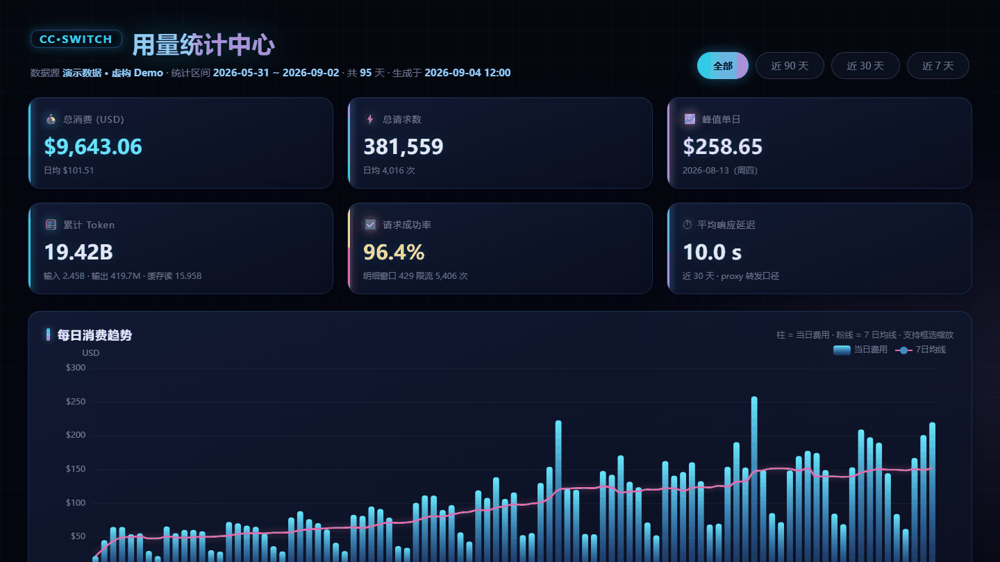

# local-stats-boards · 本地数据看板工具箱

一套渲染核心，多个数据看板。目前内置：

| 看板 | 数据源 | 内容 |
|---|---|---|
| **CC-Switch 用量统计中心** | cc-switch 本地数据库（SQLite） | 供应商消费、模型切换史、Token 构成、使用节奏热力图 |
| **WakaTime 编程时长看板** | [WakaTime](https://wakatime.com) API | 编程时长趋势、项目/语言排行、活跃度分析 |

所有看板都是**单文件 HTML**：ECharts 与数据全部内嵌，双击即开、离线可用、不依赖任何服务。



> 为什么做这个：cc-switch 的统计界面只能看最近 30 天，WakaTime 干脆没有 ZCode 插件——与其等官方，不如自己把数据拿出来画。

## 快速开始

前置：Python 3（仅标准库，无需 pip 装任何东西）。

**Windows 一键刷新**：双击 `刷新看板.bat`，全部看板重建完毕后自动打开。

**命令行**：

```bash
python sources/ccswitch.py > boards/cc-switch.html     # cc-switch 用量看板（读本地数据库）
python sources/wakatime.py  > boards/wakatime.html     # WakaTime 时长看板（调 API，自动重试限流）
python sources/ccswitch.py --demo > demo.html          # 虚构假数据版（开源展示/截图用，可公开）
```

数据是生成时刻的静态快照，想更新就重跑。

## 架构

```
local-stats-boards/
├── core/                     # ★ 只写一次的渲染核心
│   ├── base_template.html    #   骨架：暗色霓虹 CSS / KPI 卡 / 区间切换 / 卡片布局
│   ├── charts.js             #   图表注册表：trend·stack·hbar·donut·hstack·heatmap·table
│   ├── render.py             #   注入器：DATA + BOARD配置 + echarts → 单文件 HTML
│   ├── net.py                #   网络层：SSRF 白名单 + DNS 私网拒绝 + 禁重定向 + 429/断连重试
│   ├── verify.py             #   验收：无头 Chrome 截图 + 控制台错误检查（PASS/FAIL）
│   └── echarts.min.js        #   Apache ECharts 5.5.1
├── sources/                  # ★ 每个数据源一个薄适配器
│   ├── ccswitch.py           #   cc-switch.db 聚合 + 图表声明（--demo 生成假数据）
│   └── wakatime.py           #   WakaTime Summaries API 聚合 + 图表声明
├── boards/                   # 生成产物（gitignore，含个人数据不入库）
├── demo/                     # cc-switch 看板演示动图
└── export.py                 # cc-switch 数据 CSV 导出（daily/models/logs）
```

三层职责：**core 不知道数据长什么样**，只负责把 `DATA` 和 `BOARD 配置` 渲染成页面；**sources 不知道页面长什么样**，只负责取数和声明"用哪几种图表展示"；**boards 是产物**，不进版本库。

## 如何新增一个看板

只需要写一个适配器文件，三步，约 100 行：

```python
# sources/myboard.py
import os, sys, json
HERE = os.path.dirname(os.path.abspath(__file__))
sys.path.insert(0, os.path.dirname(HERE))
from core import render

# ① 取数并标准化：daily 数组是核心，每天一条记录，字段随意
def fetch():
    return [{"d": "2026-09-01", "steps": 8000}]

CONFIG_JS = r"""
window.BOARD = {
  title: '我的看板',
  ranges: [{label:'全部',days:0},{label:'近 30 天',days:30}],
  subLine: D => `记录 ${D.meta.days} 天`,
  footerHtml: '口径说明……',
  kpis: (ds, D) => [{icon:'👟', label:'总步数', value:ds.reduce((a,d)=>a+d.steps,0).toLocaleString(),
                     c1:'#22d3ee', c2:'#a78bfa'}],
  charts: (ds, D) => [{id:'trend', type:'trend', title:'每日步数', full:true,
                       values: ds=>ds.map(d=>d.steps), tip:(ds,i)=>`第 ${i} 天`}],
};
"""

data = {"meta": {"days": 1}, "daily": fetch()}
sys.stdout.write(render.render_board("我的看板", "LOGO", json.dumps(data), CONFIG_JS))
```

运行 `python sources/myboard.py > boards/myboard.html` 即得看板。内置七种图表可直接声明复用：`trend`（柱+均线+缩放）、`stack`（堆叠面积）、`hbar`（排行）、`donut`（占比环）、`hstack`（横向堆叠）、`heatmap`（热力图）、`table`（可排序表格）；声明式覆盖不了的，用 `BOARD.onInit` + `Core.registerChart` 注册自定义渲染（cc-switch 的请求质量图就是这么做的）。

## 数据口径

- **cc-switch**：`usage_daily_rollups`（长期日汇总）∪ `proxy_request_logs`（近 30 天明细），两段日期不重叠、不重复计数；明细表 `created_at` 为**秒级**时间戳；费用按 cc-switch 内置定价估算
- **WakaTime**：免费版即支持全历史 Summaries API（实测 2023 年至今均可），限速 1 请求/秒已自动处理
- 构建脚本全部 stdout 输出、失败月份/失败步骤明确报错，不会静默缺数据

## 隐私

- `boards/`、`preview/`、`*.db` 均在 `.gitignore` 中，**生成的看板和数据库不会进版本库**
- 对外展示请用 `python sources/ccswitch.py --demo` 生成的虚构数据版（固定随机种子，数字与图形都可复现）
- WakaTime API Key 只存在本机 `~/.wakatime.cfg`，脚本运行时读取，不回显不落盘

## 常见问题

- **bat 中文乱码 / 执行报错**：`刷新看板.bat` 必须保持 GBK + CRLF 编码（已是），不要用现代编辑器另存为 UTF-8
- **WakaTime 数据只更新到昨天**：心跳由各编辑器插件上报，ZCode 侧请配合 [zcode-wakatime](https://github.com/COSMICAL-CONTAINER/zcode-wakatime) 插件使用
- **看板双击打开后空白**：确认文件完整生成（几 MB 级别）；部分浏览器对 `file://` 下的大文件首屏渲染需要一两秒

## Roadmap

- [ ] ZCode 官方插件市场开放上架后，将本工具箱打包提交
- [ ] WakaTime AI 用量（token/成本）按天聚合的可靠口径
- [ ] 更多数据源适配器：Git 提交统计、番茄钟……

## 许可与署名

MIT License © 2026 [COSMICAL-CONTAINER](https://github.com/COSMICAL-CONTAINER)

协作：ZCode 智能体（GLM，Z.ai）——架构设计、看板实现与自动化验收

## 致谢

- [cc-switch](https://github.com/farion1231/cc-switch) —— 供应商切换工具，本工具箱的第一个数据源
- [WakaTime](https://wakatime.com) —— 编程时长统计服务
- [Apache ECharts](https://echarts.apache.org/) —— 图表引擎
