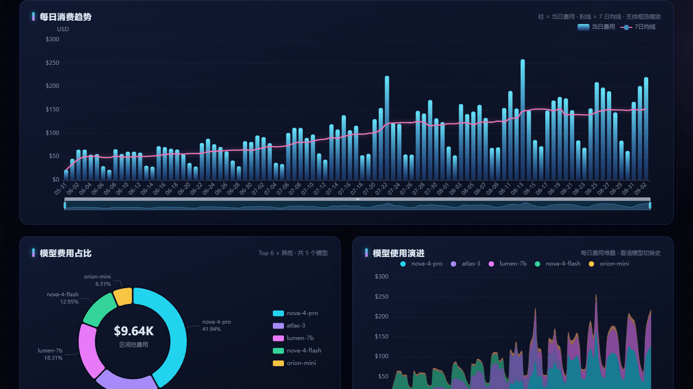
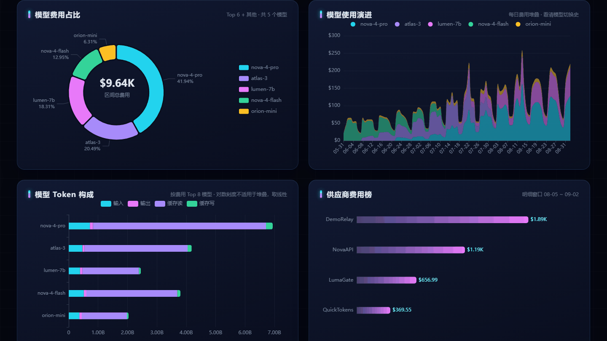
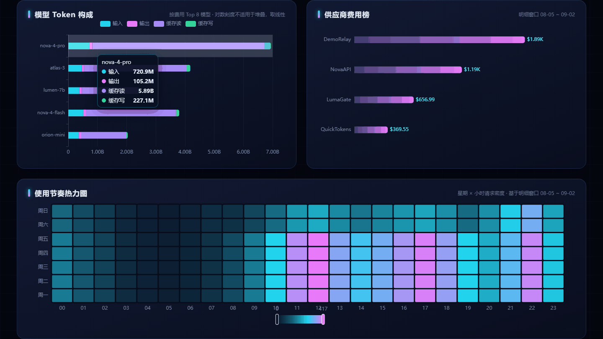
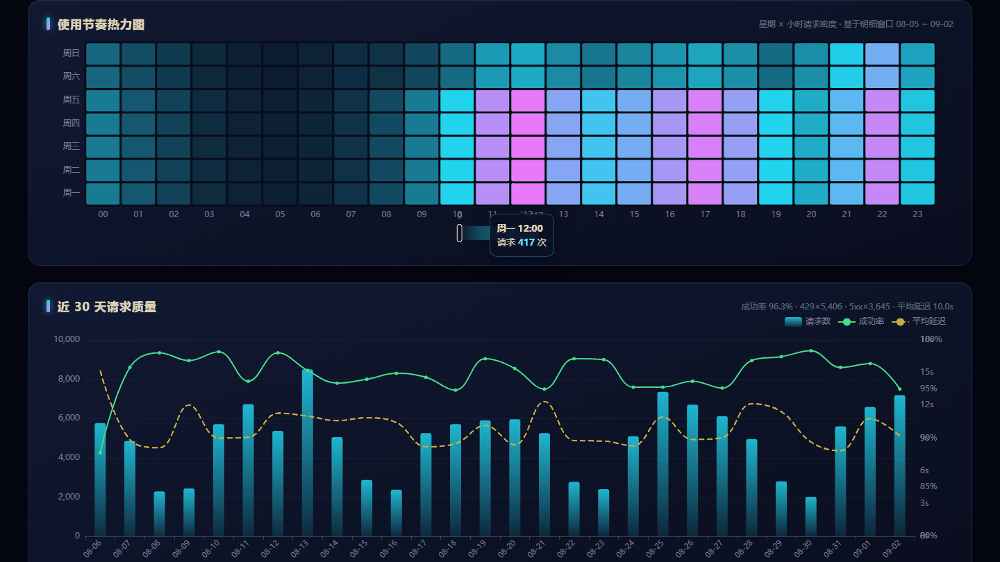
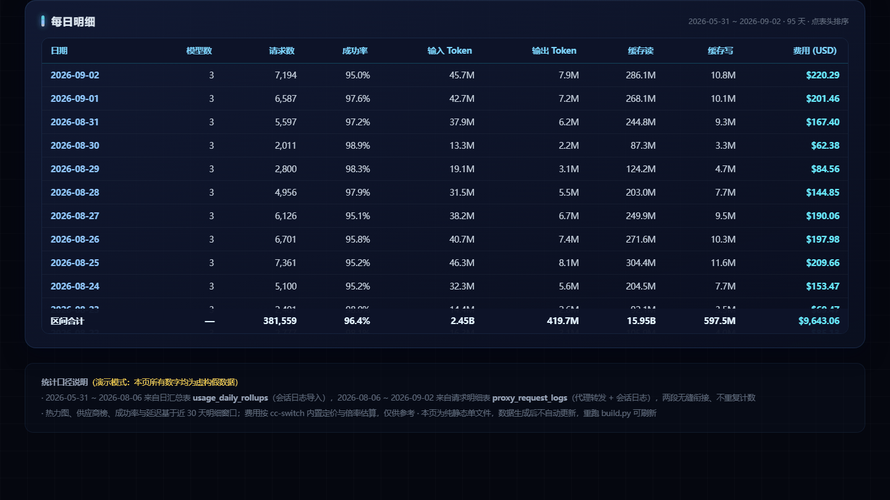

# cc-switch-stats-viewer · CC-Switch 用量统计看板

[cc-switch](https://github.com/farion1231/cc-switch) 是一个很好用的 Claude Code / Codex 供应商切换工具，但它的**用量统计只能看最近 30 天**的明细——更早的数据虽然在本地数据库里留有日汇总，却再也看不到了。

这个工具把 `~/.cc-switch/cc-switch.db` 里的**日汇总表 + 请求明细表**两段数据无缝拼合，还原出完整历史用量，并生成一个**离线单文件可视化看板**（ECharts 内嵌、数据内联，双击即开、不依赖网络）。

## 演示

以下动图按功能分组，均为虚构假数据（`python build.py --demo` 生成，固定随机种子可复现）。想亲手体验全部交互，直接下载 [`demo.html`](demo.html)（1.1 MB，纯离线单文件）双击打开即可。

**① 总览与时间范围联动** —— 切到"近 30 天"，KPI 卡片与所有图表一起切换口径


**② 每日消费趋势** —— 悬停看当日费用 / 均线 / 成功率，框选缩放任意时间段



**③ 模型分析** —— 费用占比环形图悬停，使用演进堆叠面积图看清模型切换史



**④ Token 构成与供应商费用榜** —— 输入 / 输出 / 缓存读写四段构成，供应商横向对比



**⑤ 使用节奏热力图与请求质量** —— 星期 × 24 小时使用密度；近 30 天成功率 / 延迟 / 429



**⑥ 每日明细表排序** —— 点表头按任意列排序（图为按费用降序）



## 功能

- **KPI 总览**：总消费 / 总请求 / 峰值单日 / 累计 Token / 成功率 / 平均延迟
- **时间范围联动**：全部 / 近 90 / 近 30 / 近 7 天一键切换，KPI、趋势图、模型榜、明细表同步刷新
- **每日消费趋势**：柱状 + 7 日均线 + 框选缩放，悬停看当日详情
- **模型分析**：费用占比环形图、使用演进堆叠面积图（看清模型切换史）、Token 构成（缓存读占比一目了然）
- **供应商费用榜**、**星期 × 24 小时使用节奏热力图**
- **近 30 天请求质量**：成功率、延迟、429/5xx 统计
- **每日明细表**：点表头按任意列排序

## 使用

前置：Python 3（仅标准库），本机已安装 cc-switch 且有使用记录。

**方式一**：双击 `刷新数据.bat`（Windows），自动重建看板并在浏览器打开。

**方式二**：命令行

```bash
python build.py > 我的看板.html          # 真实数据
python build.py --demo > demo.html      # 虚构演示数据（开源展示用，不含任何真实记录）
```

生成的 HTML 用任意浏览器打开即可；数据是静态快照，想更新重跑一遍。

## 数据导出（CSV）

不想看看板、想做自己的分析？`export.py` 可以把数据库里的用量数据导出为 CSV（UTF-8 带 BOM，Excel 双击打开不乱码）：

```bash
python export.py daily  > usage_daily.csv    # 每日汇总（95 天完整历史）
python export.py models > usage_models.csv   # 每日 × 模型汇总
python export.py logs   > request_logs.csv   # 近 30 天逐请求明细（12 万+ 行）
```

各文件列说明：

| 文件 | 列 |
|---|---|
| usage_daily.csv | 日期、请求数、成功数、成功率、输入/输出/缓存读/缓存写 Token、总 Token、费用USD |
| usage_models.csv | 日期、模型、请求数、输入/输出/缓存读/缓存写 Token、费用USD |
| request_logs.csv | 请求ID、本地时间、应用、供应商ID、模型、请求模型、四类 Token、费用USD、延迟ms、状态码、流式、数据来源、会话ID |

## 目录结构

```
build.py        看板构建脚本（--demo 生成假数据；只读数据库，stdout 出 HTML、stderr 出诊断）
export.py       CSV 导出脚本（daily / models / logs 三个子命令，stdout 输出、Excel 友好）
template.html   看板模板（__ECHARTS_JS__ / __DATA_JSON__ 占位符；#f=N 为 GIF 录制用演示帧深链）
echarts.min.js  Apache ECharts 5.5.1（构建时内嵌进产物）
make_gif.py     分功能演示 GIF 生成脚本（整页截图按锚点裁剪 → PIL 分组合成，输出 demo/*.gif）
刷新数据.bat     一键重建看板并打开（GBK + CRLF 编码，勿用编辑器转 UTF-8）
demo.html       演示版看板（假数据，可公开）
demo/*.gif      README 分功能演示动图（6 组）
```

## 数据口径

- `usage_daily_rollups`（长期日汇总）∪ `proxy_request_logs`（近 30 天逐请求明细），两段日期不重叠、不重复计数
- 明细表 `created_at` 为**秒级** Unix 时间戳（按毫秒除 1000 会得到 1970）
- 费用按 cc-switch 内置定价与倍率估算，仅供参考
- 全程本地计算，不联网、不上传任何数据

## 许可与署名

MIT License。

作者：[COSMICAL-CONTAINER](https://github.com/COSMICAL-CONTAINER)
协作：ZCode 智能体（GLM，Z.ai）——数据分析、看板实现与可视化验收

## 致谢

- [farion1231/cc-switch](https://github.com/farion1231/cc-switch) —— 本工具读取并展示其本地数据库，一切数据归功于它
- [Apache ECharts](https://echarts.apache.org/) —— 图表引擎
